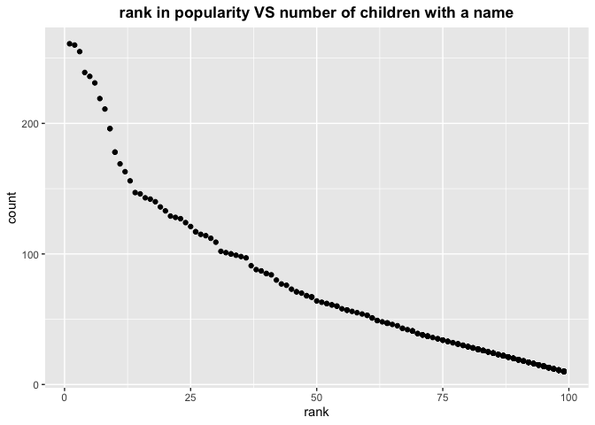

p8105\_hw2\_az2587
================
Anyu Zhu
9/30/2021

## Problem 1

Read and clean data from Mr. Trash Wheel dataset:

``` r
trash_wheel = read_excel("Trash-Wheel-Collection-Totals-8-6-19.xlsx",
                         sheet = "Mr. Trash Wheel",
                         range =  cell_cols("A:N"), col_names = TRUE, 
                         trim_ws = TRUE, skip = 1) %>%
  janitor::clean_names() %>%
  filter(!is.na(dumpster)) %>% 
  mutate(sports_balls = round(sports_balls, 0))

trash_wheel
```

    ## # A tibble: 344 x 14
    ##    dumpster month  year date                weight_tons volume_cubic_yards
    ##       <dbl> <chr> <dbl> <dttm>                    <dbl>              <dbl>
    ##  1        1 May    2014 2014-05-16 00:00:00        4.31                 18
    ##  2        2 May    2014 2014-05-16 00:00:00        2.74                 13
    ##  3        3 May    2014 2014-05-16 00:00:00        3.45                 15
    ##  4        4 May    2014 2014-05-17 00:00:00        3.1                  15
    ##  5        5 May    2014 2014-05-17 00:00:00        4.06                 18
    ##  6        6 May    2014 2014-05-20 00:00:00        2.71                 13
    ##  7        7 May    2014 2014-05-21 00:00:00        1.91                  8
    ##  8        8 May    2014 2014-05-28 00:00:00        3.7                  16
    ##  9        9 June   2014 2014-06-05 00:00:00        2.52                 14
    ## 10       10 June   2014 2014-06-11 00:00:00        3.76                 18
    ## # … with 334 more rows, and 8 more variables: plastic_bottles <dbl>,
    ## #   polystyrene <dbl>, cigarette_butts <dbl>, glass_bottles <dbl>,
    ## #   grocery_bags <dbl>, chip_bags <dbl>, sports_balls <dbl>,
    ## #   homes_powered <dbl>

Read and clean precipitation data for 2018 and 2019:

``` r
precipitation_2018 = read_excel("Trash-Wheel-Collection-Totals-8-6-19.xlsx",
                                sheet = "2018 Precipitation", range = "A2:B14", 
                                col_names = TRUE, trim_ws = TRUE) %>% 
  janitor::clean_names() %>% 
  filter(!is.na(total)) %>% 
  mutate(year = 2018) %>% 
  select(year, month, total)

precipitation_2019 = read_excel("Trash-Wheel-Collection-Totals-8-6-19.xlsx",
                                sheet = "2019 Precipitation", range = "A2:B14", 
                                col_names = TRUE, trim_ws = TRUE) %>% 
  janitor::clean_names() %>% 
  filter(!is.na(total)) %>% 
  mutate(year = 2019) %>% 
  select(year, month, total)

precipitation = 
  bind_rows(precipitation_2018, precipitation_2019) %>% 
  janitor::clean_names() %>% 
  mutate(month = month.name[month])

precipitation
```

    ## # A tibble: 18 x 3
    ##     year month     total
    ##    <dbl> <chr>     <dbl>
    ##  1  2018 January    0.94
    ##  2  2018 February   4.8 
    ##  3  2018 March      2.69
    ##  4  2018 April      4.69
    ##  5  2018 May        9.27
    ##  6  2018 June       4.77
    ##  7  2018 July      10.2 
    ##  8  2018 August     6.45
    ##  9  2018 September 10.5 
    ## 10  2018 October    2.12
    ## 11  2018 November   7.82
    ## 12  2018 December   6.11
    ## 13  2019 January    3.1 
    ## 14  2019 February   3.64
    ## 15  2019 March      4.47
    ## 16  2019 April      1.46
    ## 17  2019 May        3.58
    ## 18  2019 June       0.42

**Conclusion**

``` r
analysis_trash_wheel = 
  tibble(
    trash_kind = c(colnames(trash_wheel))[7:14],
    mean = c(as.integer(colMeans(trash_wheel[,7:14]))),
    sum = c(as.integer(colSums(trash_wheel[,7:14])))
  ) 

analysis_trash_wheel %>% 
  knitr::kable()
```

| trash\_kind      |  mean |      sum |
| :--------------- | ----: | -------: |
| plastic\_bottles |  1873 |   644365 |
| polystyrene      |  2138 |   735707 |
| cigarette\_butts | 30754 | 10579420 |
| glass\_bottles   |    25 |     8724 |
| grocery\_bags    |  1311 |   451062 |
| chip\_bags       |  1780 |   612414 |
| sports\_balls    |    11 |     4063 |
| homes\_powered   |    43 |    15075 |

The dataset of Mr. Trash Wheel contains **344** observations. The
variables included in the dataset are: dumpster, month, year, date,
weight\_tons, volume\_cubic\_yards, plastic\_bottles, polystyrene,
cigarette\_butts, glass\_bottles, grocery\_bags, chip\_bags,
sports\_balls, homes\_powered. During 2014-05-16 to 2019-06-17,
Mr. Trash Wheel collected 1122.45 tons of trash. The mean and sum of
each kind of trash are displayed in the table above.  

The precipitation dataset after combination covers data in 2018 and 2019
with **18** observations. There are three variables: year, month, total.
The sum of all precipitation is **87**, and the mean of the data is
**4.8333333**.

Total precipitation in 2018 is **70.33**.  
The median number of sports balls in a dumpster in 2017 is **8**.

## Problem 2

Clean the data in pols-month.csv:

``` r
pols_month = read_csv("fivethirtyeight_datasets/pols-month.csv") %>% 
  janitor::clean_names() %>% 
  separate(mon, into = c("year", "month", "day"), sep = "-") %>% 
  mutate(month = month.name[as.numeric(month)],
         president = recode(prez_dem, `0` = "gop", `1` = "dem"),
         year = as.numeric(year)) %>% 
  select(-prez_dem, -prez_gop) %>% 
  select(-day)
```

    ## 
    ## ── Column specification ────────────────────────────────────────────────────────
    ## cols(
    ##   mon = col_date(format = ""),
    ##   prez_gop = col_double(),
    ##   gov_gop = col_double(),
    ##   sen_gop = col_double(),
    ##   rep_gop = col_double(),
    ##   prez_dem = col_double(),
    ##   gov_dem = col_double(),
    ##   sen_dem = col_double(),
    ##   rep_dem = col_double()
    ## )

``` r
pols_month
```

    ## # A tibble: 822 x 9
    ##     year month     gov_gop sen_gop rep_gop gov_dem sen_dem rep_dem president
    ##    <dbl> <chr>       <dbl>   <dbl>   <dbl>   <dbl>   <dbl>   <dbl> <chr>    
    ##  1  1947 January        23      51     253      23      45     198 dem      
    ##  2  1947 February       23      51     253      23      45     198 dem      
    ##  3  1947 March          23      51     253      23      45     198 dem      
    ##  4  1947 April          23      51     253      23      45     198 dem      
    ##  5  1947 May            23      51     253      23      45     198 dem      
    ##  6  1947 June           23      51     253      23      45     198 dem      
    ##  7  1947 July           23      51     253      23      45     198 dem      
    ##  8  1947 August         23      51     253      23      45     198 dem      
    ##  9  1947 September      23      51     253      23      45     198 dem      
    ## 10  1947 October        23      51     253      23      45     198 dem      
    ## # … with 812 more rows

Clean the data in snp.csv:

``` r
snp = read_csv("fivethirtyeight_datasets/snp.csv") %>% 
  janitor::clean_names() %>% 
  separate(date, into = c("month", "day", "year"), sep = "/") %>% 
  mutate(month = month.name[as.numeric(month)]) %>% 
  mutate(year = as.numeric(year)) %>% 
  mutate(year = ifelse(year>90, year+1900, year + 2000)) %>% 
  select(-day) %>% 
  select(year, month, everything())
```

    ## 
    ## ── Column specification ────────────────────────────────────────────────────────
    ## cols(
    ##   date = col_character(),
    ##   close = col_double()
    ## )

``` r
snp
```

    ## # A tibble: 787 x 3
    ##     year month    close
    ##    <dbl> <chr>    <dbl>
    ##  1  2015 July     2080.
    ##  2  2015 June     2063.
    ##  3  2015 May      2107.
    ##  4  2015 April    2086.
    ##  5  2015 March    2068.
    ##  6  2015 February 2104.
    ##  7  2015 January  1995.
    ##  8  2014 December 2059.
    ##  9  2014 November 2068.
    ## 10  2014 October  2018.
    ## # … with 777 more rows

Clean the data in unemployment.csv:

``` r
unemployment = read_csv("fivethirtyeight_datasets/unemployment.csv") %>% 
  janitor::clean_names() %>% 
  pivot_longer(jan:dec,
               names_to = "month",
               values_to = "percentage") %>% 
  mutate(month = as.factor(month)) %>% 
  mutate(month = month.name[month])
```

    ## 
    ## ── Column specification ────────────────────────────────────────────────────────
    ## cols(
    ##   Year = col_double(),
    ##   Jan = col_double(),
    ##   Feb = col_double(),
    ##   Mar = col_double(),
    ##   Apr = col_double(),
    ##   May = col_double(),
    ##   Jun = col_double(),
    ##   Jul = col_double(),
    ##   Aug = col_double(),
    ##   Sep = col_double(),
    ##   Oct = col_double(),
    ##   Nov = col_double(),
    ##   Dec = col_double()
    ## )

``` r
unemployment
```

    ## # A tibble: 816 x 3
    ##     year month     percentage
    ##    <dbl> <chr>          <dbl>
    ##  1  1948 May              3.4
    ##  2  1948 April            3.8
    ##  3  1948 August           4  
    ##  4  1948 January          3.9
    ##  5  1948 September        3.5
    ##  6  1948 July             3.6
    ##  7  1948 June             3.6
    ##  8  1948 February         3.9
    ##  9  1948 December         3.8
    ## 10  1948 November         3.7
    ## # … with 806 more rows

Join the three datasets above:

``` r
five_thirty_eight = 
  left_join(pols_month, snp, unemployment, by = c("year", "month"))

five_thirty_eight
```

    ## # A tibble: 822 x 10
    ##     year month   gov_gop sen_gop rep_gop gov_dem sen_dem rep_dem president close
    ##    <dbl> <chr>     <dbl>   <dbl>   <dbl>   <dbl>   <dbl>   <dbl> <chr>     <dbl>
    ##  1  1947 January      23      51     253      23      45     198 dem          NA
    ##  2  1947 Februa…      23      51     253      23      45     198 dem          NA
    ##  3  1947 March        23      51     253      23      45     198 dem          NA
    ##  4  1947 April        23      51     253      23      45     198 dem          NA
    ##  5  1947 May          23      51     253      23      45     198 dem          NA
    ##  6  1947 June         23      51     253      23      45     198 dem          NA
    ##  7  1947 July         23      51     253      23      45     198 dem          NA
    ##  8  1947 August       23      51     253      23      45     198 dem          NA
    ##  9  1947 Septem…      23      51     253      23      45     198 dem          NA
    ## 10  1947 October      23      51     253      23      45     198 dem          NA
    ## # … with 812 more rows

**Conclusion**  
The pols\_month dataset has **822** rows and **9** columns, the
variables are year, month, gov\_gop, sen\_gop, rep\_gop, gov\_dem,
sen\_dem, rep\_dem, president. The set covers data from **1947 to
2015**.  
The snp dataset contains **787** rows and **3** columns, the variables
are year, month, close. The set covers data from **1991 to 2090**.  
The unemployment datset contains **816** rows and **3** columns, the
variables are year, month, percentage. The set covers data from **1948
to 2015**.  
Joining the three sets by year and month, we get a dataset with **822**
rows and **10** columns. The data cover from **1947 to 2015**. The
variables are year, month, gov\_gop, sen\_gop, rep\_gop, gov\_dem,
sen\_dem, rep\_dem, president, close.

## Problem 3

Load and clean the data of popularity of baby names:

``` r
popular_baby_names = read_csv("Popular_Baby_Names.csv") %>% 
  janitor::clean_names() %>% 
  mutate(gender = str_to_lower(gender),
         ethnicity = str_to_lower(ethnicity),
         ethnicity = recode(ethnicity, "asian and paci" = "asian and pacific islander", "black non hisp" = "black non hispanic", "white non hisp" = "white non hispanic"),
         childs_first_name = str_to_lower(childs_first_name),
         childs_first_name = str_to_title(childs_first_name)) %>% 
  distinct(.keep_all = TRUE)
```

    ## 
    ## ── Column specification ────────────────────────────────────────────────────────
    ## cols(
    ##   `Year of Birth` = col_double(),
    ##   Gender = col_character(),
    ##   Ethnicity = col_character(),
    ##   `Child's First Name` = col_character(),
    ##   Count = col_double(),
    ##   Rank = col_double()
    ## )

``` r
popular_baby_names
```

    ## # A tibble: 12,181 x 6
    ##    year_of_birth gender ethnicity                  childs_first_name count  rank
    ##            <dbl> <chr>  <chr>                      <chr>             <dbl> <dbl>
    ##  1          2016 female asian and pacific islander Olivia              172     1
    ##  2          2016 female asian and pacific islander Chloe               112     2
    ##  3          2016 female asian and pacific islander Sophia              104     3
    ##  4          2016 female asian and pacific islander Emily                99     4
    ##  5          2016 female asian and pacific islander Emma                 99     4
    ##  6          2016 female asian and pacific islander Mia                  79     5
    ##  7          2016 female asian and pacific islander Charlotte            59     6
    ##  8          2016 female asian and pacific islander Sarah                57     7
    ##  9          2016 female asian and pacific islander Isabella             56     8
    ## 10          2016 female asian and pacific islander Hannah               56     8
    ## # … with 12,171 more rows

Produce a table showing rank in popularity of **Olivia** as a female
baby name over time:

``` r
popular_baby_names %>% 
  filter(childs_first_name == "Olivia", gender == "female") %>% 
  select(year_of_birth, ethnicity, rank) %>% 
  pivot_wider(names_from = "year_of_birth",
              values_from = "rank")
```

    ## # A tibble: 4 x 7
    ##   ethnicity                  `2016` `2015` `2014` `2013` `2012` `2011`
    ##   <chr>                       <dbl>  <dbl>  <dbl>  <dbl>  <dbl>  <dbl>
    ## 1 asian and pacific islander      1      1      1      3      3      4
    ## 2 black non hispanic              8      4      8      6      8     10
    ## 3 hispanic                       13     16     16     22     22     18
    ## 4 white non hispanic              1      1      1      1      4      2

Produce a table showing the most popular name among male children over
time:

``` r
popular_baby_names %>% 
  filter(gender == "male", rank == "1") %>% 
  select(year_of_birth, ethnicity, childs_first_name) %>% 
  pivot_wider(names_from = "year_of_birth",
              values_from = "childs_first_name")
```

    ## # A tibble: 4 x 7
    ##   ethnicity                  `2016` `2015` `2014` `2013` `2012` `2011` 
    ##   <chr>                      <chr>  <chr>  <chr>  <chr>  <chr>  <chr>  
    ## 1 asian and pacific islander Ethan  Jayden Jayden Jayden Ryan   Ethan  
    ## 2 black non hispanic         Noah   Noah   Ethan  Ethan  Jayden Jayden 
    ## 3 hispanic                   Liam   Liam   Liam   Jayden Jayden Jayden 
    ## 4 white non hispanic         Joseph David  Joseph David  Joseph Michael

Produce a scatter plot showing the number of children with a name (y
axis) against the rank in popularity of that name (x axis) for male,
white non-hispanic children born in 2016.

``` r
scatter_df = popular_baby_names %>% 
  filter(gender == "male", ethnicity == "white non hispanic", year_of_birth == 2016) %>% 
  select(childs_first_name, rank, count)

ggplot(scatter_df, aes(x = rank, y = count)) + geom_point() + labs(title = "rank in popularity VS number of children with a name") + theme(plot.title = element_text(face = "bold", hjust = 0.5))
```

<!-- -->
